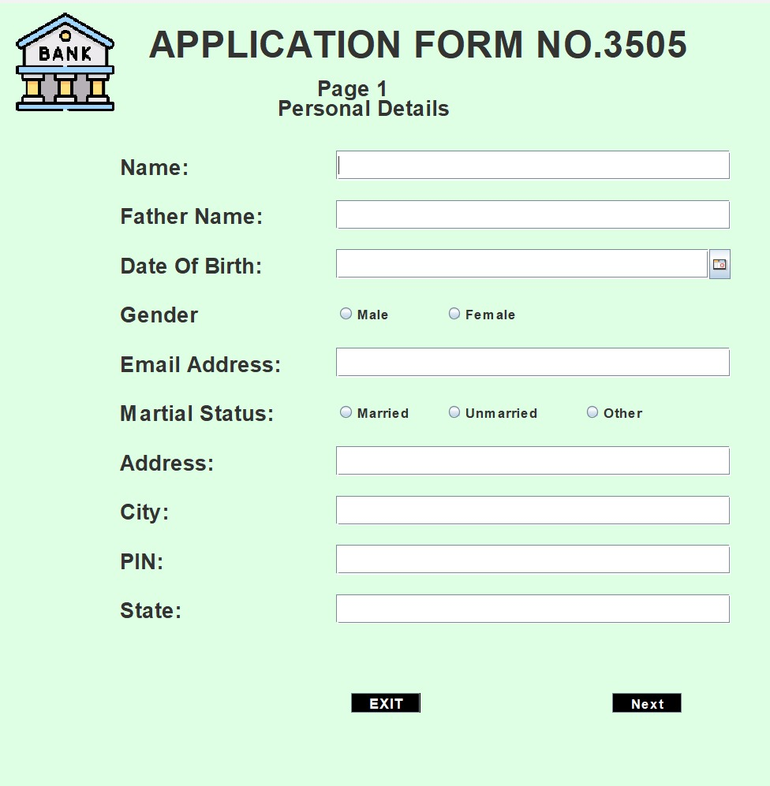
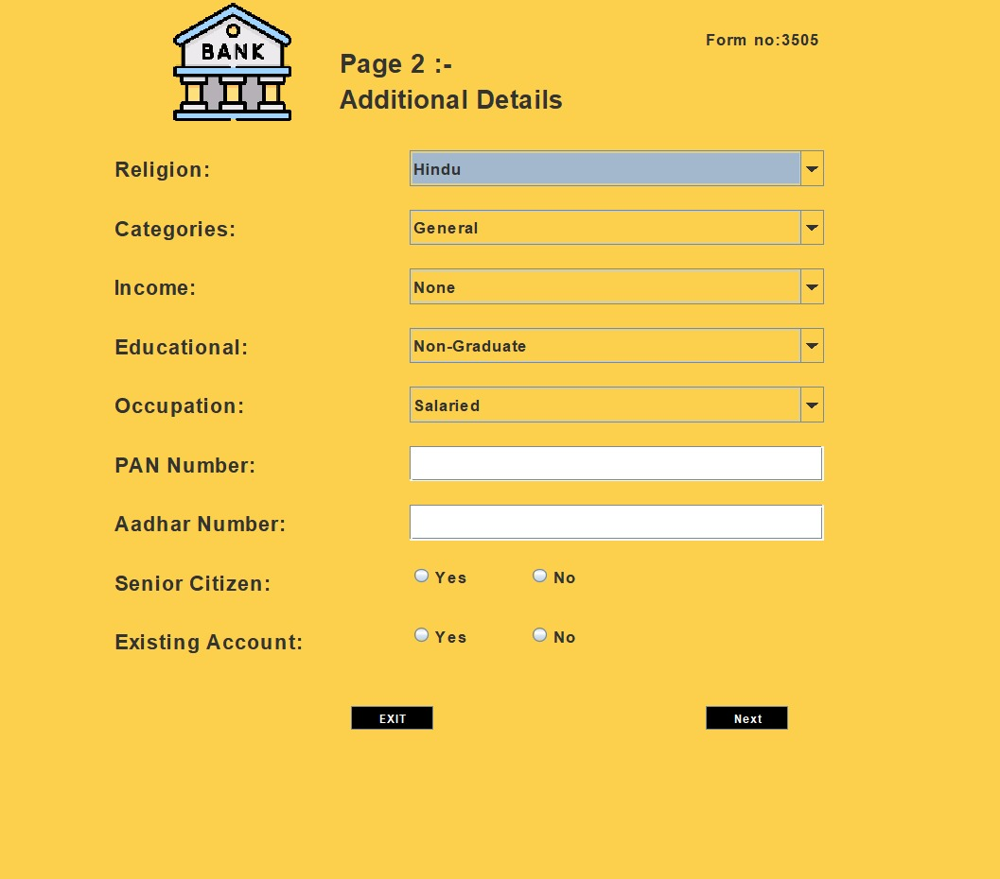
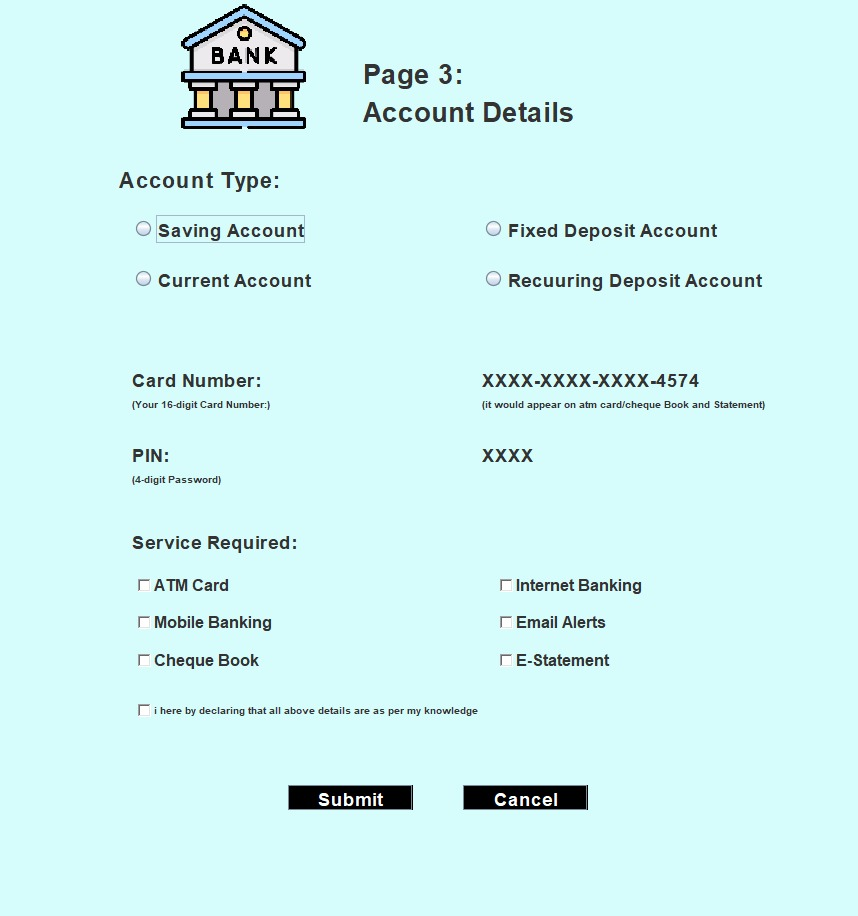
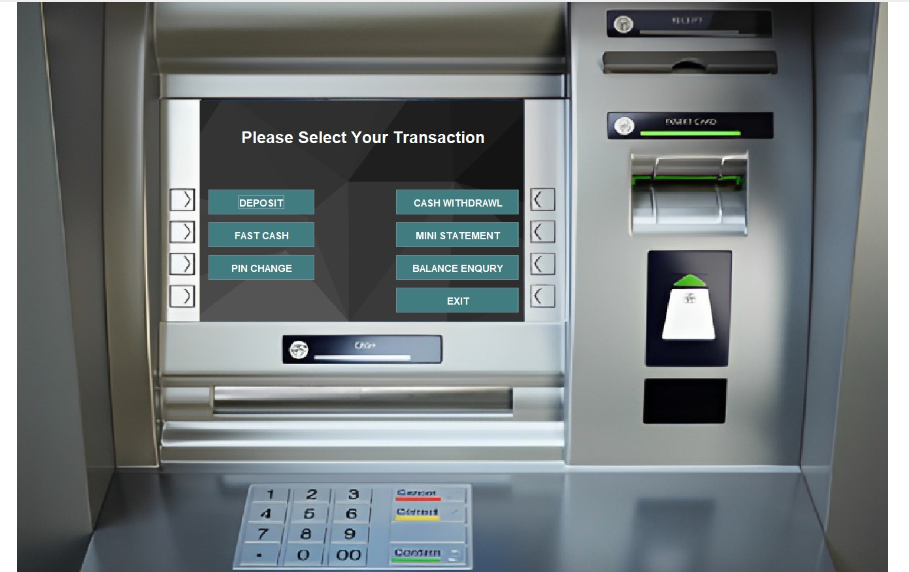
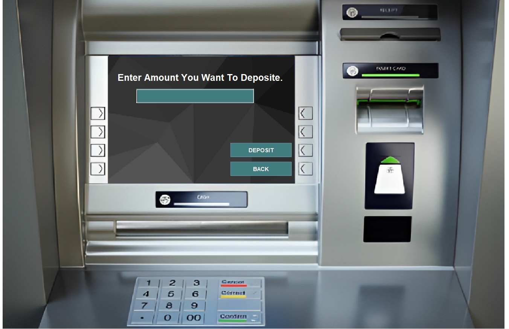
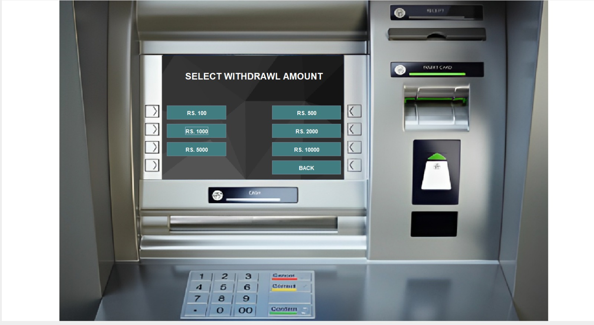
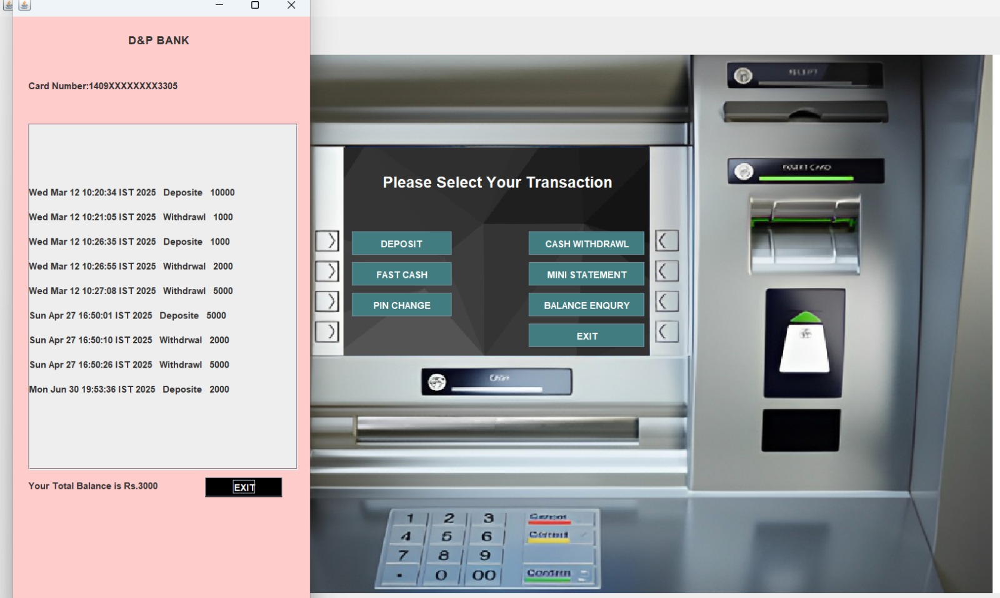

# ATM Management System

## Overview

ATM Management System is a desktop-based banking application developed using Java Swing and MySQL. The system allows users to perform common ATM operations such as account creation, deposits, withdrawals, balance enquiry, PIN changes, and transaction history management through a graphical user interface.

The project was developed to simulate real-world ATM functionality while demonstrating database integration, user authentication, and banking transaction management using Java and MySQL.

---

## Features

* User Authentication
* New Account Registration
* Multi-Step Account Application Process
* Deposit Money
* Withdraw Money
* Fast Cash Transactions
* Balance Enquiry
* Mini Statement Generation
* PIN Change Functionality
* Transaction History
* MySQL Database Integration
* Java Swing Graphical User Interface

---

## Technologies Used

### Frontend

* Java Swing
* JFrame

### Backend

* MySQL

### Development Tools

* Eclipse IDE
* MySQL Workbench

---

## Project Structure

```text
ATM_Management_System
│
├── src
│   ├── Logins
│   └── image
│
├── screenshots
├── README.md
└── .gitignore
```

---

## Screenshots

### ATM Login Screen


### Account Application Form - Page 1



### Account Application Form - Page 2



### Account Application Form - Page 3



### ATM Dashboard



### Deposit Money



### Fast Cash



### Mini Statement



### Withdraw Money


---

## Installation

### 1. Clone the Repository

```bash
git clone https://github.com/Dhruv05-hue/ATM-Management-System-Java.git
```

### 2. Open the Project

Open the project in Eclipse IDE.

### 3. Configure MySQL

Create the required database and tables in MySQL Workbench.

### 4. Update Database Credentials

Update the database username and password in the source code according to your local MySQL configuration.

### 5. Run the Application

Run the application from Eclipse IDE.

---

## Author

**Dhruv Pawar**

GitHub: https://github.com/Dhruv05-hue

---

## License

This project is intended for educational and portfolio purposes.
